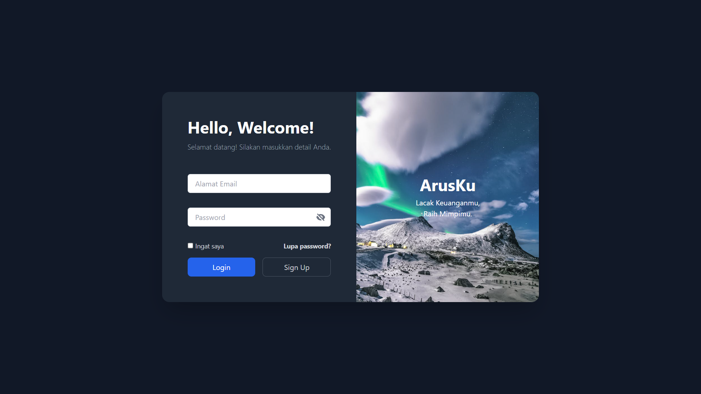

# ArusKu 🌊

> Pahami Arus Kas, Kendalikan Masa Depan.



---

## Deskripsi

**ArusKu** adalah sebuah aplikasi web *Personal Finance Tracker* modern yang dirancang untuk membantu pengguna melacak, menganggarkan, dan menganalisis keuangan pribadi mereka dengan antarmuka yang bersih dan intuitif. Dari pencatatan transaksi harian hingga visualisasi tren bulanan, ArusKu menyediakan semua alat yang dibutuhkan untuk mencapai kejelasan finansial.

Proyek ini merupakan studi kasus pengembangan aplikasi web modern yang dibangun secara kolaboratif dengan model AI dari **IBM Granite**. AI berperan sebagai *pair programmer* yang membantu dalam pembuatan kode, perbaikan *bug* secara *real-time*, desain fitur, dan refactoring untuk memastikan kode tetap bersih dan efisien.

---

## Teknologi yang Digunakan

-   **Frontend:** React (Vite), Tailwind CSS
-   **Backend & Database:** Google Firebase (Authentication, Firestore)
-   **Library Tambahan:**
    -   `Recharts`: Untuk visualisasi data dan grafik.
    -   `@headlessui/react`: Untuk komponen UI yang aksesibel (Dropdown, Tabs).
    -   `react-datepicker`: Untuk fungsionalitas kalender.
-   **Dukungan AI:** IBM Granite Language Model

---

## Fitur Utama

-   🔐 **Otentikasi Pengguna Lengkap:** Sistem login, registrasi, reset password, ubah email/password, dan hapus akun yang aman.
-   📊 **Dashboard Interaktif:** Ringkasan total saldo dan diagram donat yang merinci semua kategori transaksi (pemasukan & pengeluaran).
-   💸 **Manajemen Transaksi (CRUD):** Fungsionalitas penuh untuk menambah, melihat, mengedit, dan menghapus transaksi.
-   🏷️ **Kategori Kustom:** Pengguna dapat membuat, mengedit, dan menghapus kategori pemasukan dan pengeluaran mereka sendiri.
-   🎯 **Anggaran Bulanan:** Atur batas anggaran untuk setiap kategori pengeluaran dan pantau progresnya secara visual melalui *progress bar*.
-   📈 **Halaman Laporan:** Analisis tren keuangan dari waktu ke waktu dengan grafik garis interaktif yang dapat dialihkan antara tampilan harian dan bulanan.
-   🔍 **Filter & Pencarian Lanjutan:** Saring riwayat transaksi berdasarkan rentang waktu, tipe, dan kategori, serta dilengkapi fitur pencarian dan paginasi.
-   📱 **Desain Responsif & 🌙 Dark Mode:** Tampilan adaptif di semua perangkat dengan pilihan tema terang dan gelap yang bisa diubah kapan saja.

---

## Instalasi & Setup

Untuk menjalankan proyek ini secara lokal, ikuti langkah-langkah berikut:

1.  **Clone repositori ini:**
    ```bash
    git clone [https://github.com/nama-anda/arusku-app.git](https://github.com/nama-anda/arusku-app.git)
    ```

2.  **Masuk ke direktori proyek:**
    ```bash
    cd arusku-app
    ```

3.  **Install semua dependensi:**
    ```bash
    npm install
    ```

4.  **Siapkan Firebase:**
    -   Buat sebuah proyek baru di [Firebase Console](https://console.firebase.google.com/).
    -   Aktifkan layanan **Authentication** (dengan provider Email/Password) dan **Firestore Database**.
    -   Di pengaturan proyek Anda, buat sebuah "Web App" baru dan salin kredensial konfigurasinya.

5.  **Buat file `.env.local`:**
    Buat file bernama `.env.local` di direktori utama proyek dan isi dengan kredensial Firebase Anda.
    > ```
    > VITE_FIREBASE_API_KEY=xxxxxxxxxxxxxxxxxxxxxxxx
    > VITE_FIREBASE_AUTH_DOMAIN=xxxxxxxxxxxxxxxxxxxxxxxx
    > VITE_FIREBASE_PROJECT_ID=xxxxxxxxxxxxxxxxxxxxxxxx
    > VITE_FIREBASE_STORAGE_BUCKET=xxxxxxxxxxxxxxxxxxxxxxxx
    > VITE_FIREBASE_MESSAGING_SENDER_ID=xxxxxxxxxxxxxxxxxxxxxxxx
    > VITE_FIREBASE_APP_ID=xxxxxxxxxxxxxxxxxxxxxxxx
    > ```

6.  **Jalankan aplikasi:**
    ```bash
    npm run dev
    ```
    Aplikasi sekarang akan berjalan di `http://localhost:5173`.

---

## Penjelasan Dukungan AI

Pengembangan ArusKu secara signifikan dibantu oleh model AI **IBM Granite**. Model ini tidak hanya menulis kode, tetapi bertindak sebagai mitra kolaboratif dalam seluruh siklus hidup proyek:

-   **Generasi Kode:** Menghasilkan kode boilerplate untuk komponen React, *hook*, dan konteks, mempercepat proses pengembangan awal.
-   **Debugging & Troubleshooting:** Menganalisis pesan error yang kompleks (dari `npm`, Vite, React, hingga Firebase), mengidentifikasi akar masalah, dan memberikan solusi yang tepat.
-   **Desain Fitur & UX:** Memberikan saran untuk fitur-fitur baru (seperti Budgeting, Laporan), memberikan ide untuk perbaikan UX (implementasi Tab, Dark Mode), dan menyarankan library yang sesuai.
-   **Refactoring Kode:** Membantu merapikan dan menyederhanakan logika yang kompleks, seperti menggabungkan beberapa `useEffect` menjadi satu alur data yang lebih efisien.

Proyek ini menunjukkan bagaimana sinergi antara developer dan AI dapat menghasilkan aplikasi yang fungsional, modern, dan aman dengan lebih cepat.